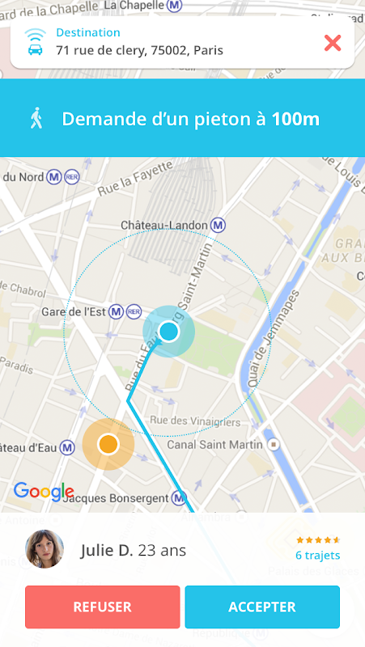

# Ramy Mehanna — Senior Mobile Developer Portfolio

## Contact Information

- **Location:** Cairo, Egypt
- **Phone:** +20 1286686558
- **Email:** [ramyemad1995@gmail.com](mailto:ramyemad1995@gmail.com)
- **LinkedIn:** [https://www.linkedin.com/in/ramy-mehanna](https://www.linkedin.com/in/ramy-mehanna)

## About

Senior Software Developer with over 7 years of experience in native Android (Java/Kotlin) and cross-platform (React Native) development. Proven expertise in leading end-to-end mobile app development, mentoring teams, and driving revenue growth through innovative solutions. Adept at Agile methodologies and modern CI/CD pipelines, with a passion for delivering high-quality software in global corporate environments.

## Projects

### Ziwo — React Native & Android

**Brief:** The ZIWO Agent App empowers you to use your cloud contact center effortlessly from your mobile device. With a brand-new design and enhanced features, staying connected with your clients has never been more seamless. Available on both iOS/Android (React Native) and native Android platforms.

**React Native Screenshots:**

**Android Screenshots:**

### MeinVodafone — React Native & Android

**Brief:** Consumer self‑care app for Vodafone customers to manage lines and services, track usage, pay bills, handle top‑ups/add‑ons, and access support. Available on both iOS/Android (React Native) and native Android platforms.

**React Native Screenshots:**

**Android Screenshots:**

### RLPA (BMW Foundation) — Kotlin/Android

**Brief:** Responsible Leaders Platform mobile app that connects members of the BMW Foundation community, enabling networking, communication, and program engagement.

**Screenshots:**

### Ouihop — Java/Android

**Brief:** Urban carpooling and ride‑sharing app operating in cities such as Bordeaux, Lyon, Montreal, and the Paris region, matching drivers and riders for shared trips. We also developed a comprehensive SDK for third-party integration.

**Screenshots:**

### Repsy — Kotlin/Android

**Brief:** Bands reservation marketplace connecting "Talents" (artists) with "Bookers" (venues/organizers), facilitating discovery, booking, and collaboration.

### MY Atecna — Java/Android

**Brief:** Internal communication and productivity app for Atecna employees, centralizing updates and work tools for the company's teams.

## Tech Stack

- **Android:** Kotlin, Java, MVVM, Jetpack components
- **Cross‑platform:** React Native, TypeScript/JavaScript
- **Tooling:** Gradle, Fastlane, CI/CD (GitHub Actions/Bitrise/Jenkins)
- **Testing:** JUnit, Espresso, Jest
- **Cloud & Services:** Firebase (FCM, Functions), Google Cloud Speech‑to‑Text
- **Practices:** Code review, mentoring, Agile/Scrum, roadmap & KPI definition
